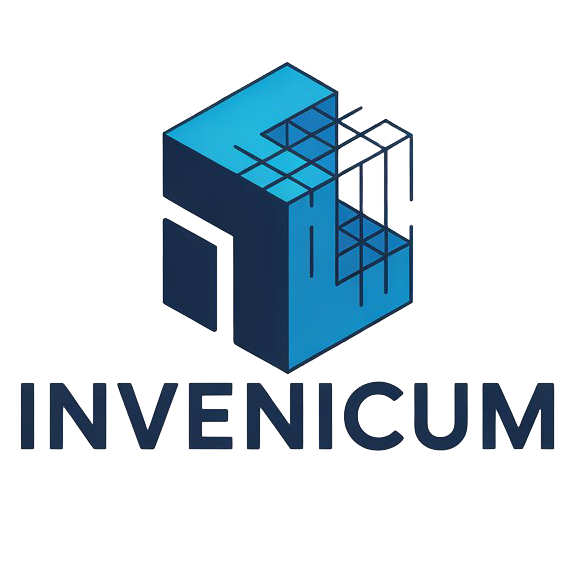

<p align="center">
  
</p>

<p align="center">
  <strong>The intelligent open-source core for your personal collections.</strong><br>
  Manage, track, and organize with AI power, keeping your data strictly private.
</p>

<p align="center">
  <a href="https://github.com/lopiv2/invenicum/stargazers"></a>
  <a href="https://github.com/lopiv2/invenicum/tags">
  
</a>
  <a href="https://ghcr.io/lopiv2/invenicum"></a>
  
</p>

---

## 🚀 Overview

**Invenicum** is a self-hosted inventory management system that leverages **Google Gemini AI** to simplify the tedious task of cataloging items. Whether it's books, tools, electronics, or collectibles, Invenicum handles the metadata for you with high-precision intelligence.

> [!IMPORTANT]
> **AI Setup:** This project currently uses **Google Gemini** as its core AI engine. A valid **Gemini API Key** is required for all automated features.

---

## ✨ The Cool Stuff (Core Features)

Why settle for a boring spreadsheet? Invenicum is packed with **game-changing tools** to make managing your stuff actually fun. Here are the highlights:

### 🤖 1. AI Talk & Auto-fill (Gemini Powered)

Stop typing, start talking. You can **chat with your app** to add items or let the AI **auto-fill metadata from a simple URL**. Just give it a name or a link, and Gemini handles titles, descriptions, and categories. It’s like having a personal librarian who never sleeps.

### 🤝 2. The "Where's My Stuff?" Tracker (Loans)

Lent your favorite book or tool to a friend and never saw it again? **Not anymore.** Track exactly who has what, set return dates, and avoid those awkward _"hey, do you still have my..."_ texts.

### 📊 3. Pro Dashboard & Market Value

Keep an eye on the money. Visualize your collection's value with **slick charts and real-time market prices** via barcode scanning. Watch your hoard evolve from a messy pile into a professional-grade asset.

### 🏷️ 4. Physical Meets Digital (QR Labels)

Generate and print **QR codes** for your items. Stick them on boxes or tools, scan them with your phone, and _boom_—instant access to the technical sheet. No more digging through boxes to know what's inside.

### 🧩 5. Plugin & Template Marketplace

Every collector is a world. Power up your server with **community-made templates and plugins**. Whether you're into vintage watches or rare succulent seeds, there's a specialized setup for you.

### 🌍 6. Global & Multi-Currency Ready

Buying from Japan? Selling to the US? Manage your costs and values in **any currency** with automatic rate conversion and a fully **multilingual interface**. No calculator (or dictionary) needed.

### 📄 7. Smart API Integrations

Invenicum isn't an island. It features **multiple API integrations** and notification systems (Webhooks, etc.) to keep your workflow automated and your alerts on time.

### 👥 8. Multi-User & Permissions

Share the love (but keep control). Create accounts for family members or employees with **specific roles**. You decide who can see, edit, or manage each specific collection.

> **...and much more!** From **Achievement Unlocks** 🏆 for your cataloging progress to **Customizable Alerts**, there are plenty of features waiting for you to discover them inside the app.

---

## 📸 Screenshots

For more screenshots and additional information, visit https://invenicum.com/en/.

---

## 🛠️ Installation

### Quick Start with Docker

The easiest way to get started is with Docker Compose.

Use the English website Quick Deploy section as the single source of truth for Docker Compose:

https://invenicum.com/en/#quick-deploy

1. **Copy the latest compose from the website and save it as `docker-compose.yml`.**

2. **Start Invenicum:**

```bash
docker compose up -d
```
